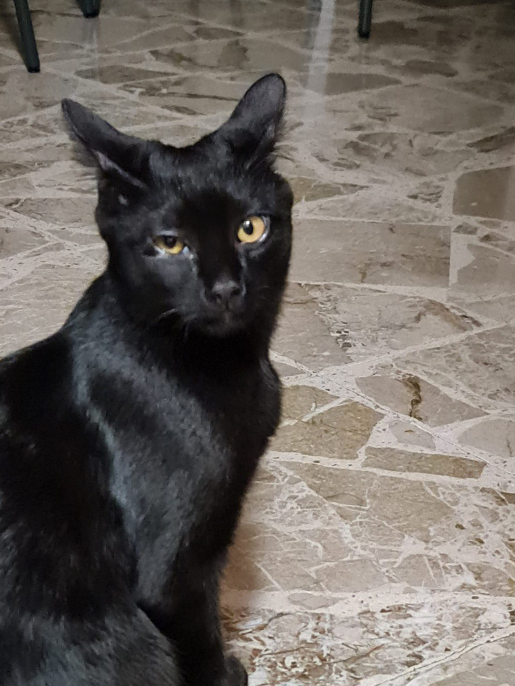
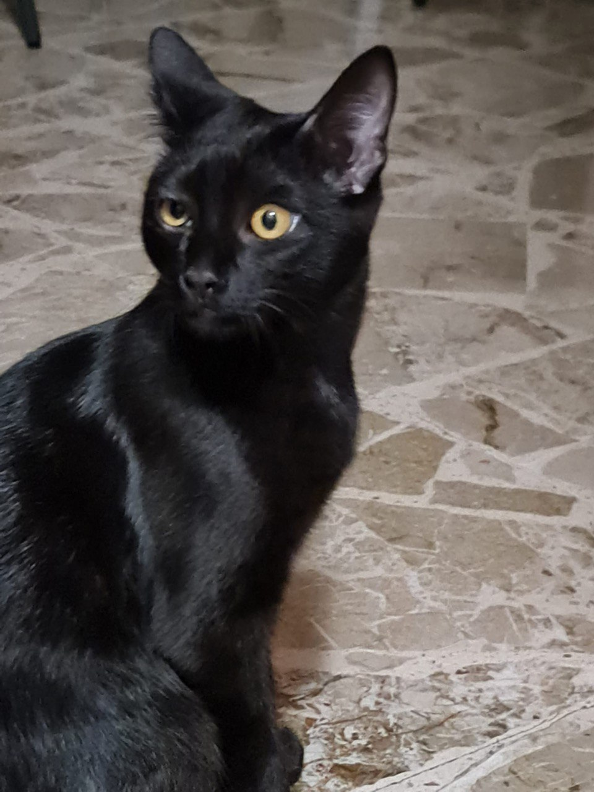

+++
date = '2026-02-04T21:25:34+01:00'
draft = false
title = 'Lipogramma'
+++

4 Febbraio 2026
# Lipogramma

> Quali «assiomi» potrebbero avere senso in letteratura? Uno degli esempi più semplici è quello dei cosiddetti «lipogrammi», cioè componimenti da cui vengono escluse tutte le parole che contengono determinate lettere (dal greco leipó, «lascio» e gramma, «lettera»). Il più noto tra i romanzi lipogrammatici è ancora una volta opera del caro Georges Perec: La scomparsa, uscito nel 1969. Il testo prevede un solo assioma: non si può usare la lettera e. Ora, in molte, se non tutte, le lingue europee, la lettera e è la più difficile da escludere, poiché è la più comune. In francese, più di un sesto delle lettere di un qualsiasi testo è costituito da e (incluse le versioni accentate come è, é ed ê). Provate a scrivere una frase senza e. Compito piuttosto arduo (vedete quanto è difficile? O meglio: avete capito la difficoltà?).

_C'era n volte_ -Sarah Hart

Sfida accettata.

## Elio Fabrizio e la cimice che lo ha reso guercio

Un giorno, fuori dal culorium, all’aria calda (quaranta gradi!) sotto la volta azzurra limpida lodata da chi ringrazia dio dopo una buona notizia, si riposano il Topins in compagnia del Tipins con il loro gattino. 

Il gattino gioca, non si stanca mai. Salta, va di qua, va di là, rapidissimo a più non posso, sui suoi quattro piccoli zampini.

Il gattino gioca con un nuovo amico: la sfumatura, di cui fu tinto dall’orologiaio di cui Darwin non fu convinto, ricorda un pistacchio. Lo ricorda la sua misura, in aggiunta alla cromatura. Si tratta di colui il quale non ha ossa, occhi grandi, mani, ciglia, polmoni o naso, lingua o labbra: non pronuncia suono (non ha la padronanza di ciò: proprio non può) quindi non dichiara la sua volontà, non annuncia di trovarsi al tuo cospetto. Magari, solitario, lo fa apposta: si rifiuta.

Ma di sicuro ama la sua vita così con ciò di cui ha il corpo fatto. Gli altri lo accusano in quanto brutto, piccolo, invasivo, noioso, stupido. Lui non si turba di ciò: piccolo di forma, ma maturo di spirito: saggio, si concentra sull’importanza di studio, la logica, la furbizia: la sua virtù più intima di cui si rinforza la sua anima. 

“Tanto, un giorno sarà fatta giustizia su tutti voi ingiusti ignoranti: sono piccolo, quindi non conosco affatto la statura di dio!! Mandarvi al boia sarà una goduria tutta mia[^1]. Lo farò con la mia astuzia.”

Il gattino gioca, ma lui non ha voglia: proprio non gli va di distrarsi: ha una famiglia a cui bada ogni giorno, hanno bisogno di lui subito. Stava proprio andando via.

Il gattino non lo sa, quindi continua, convinto, con la sua attività ludico-motoria mattutina: lo stuzzica, lo provoca, gli dà troppo fastidio - non il modo comportarsi più consono, non il più adatto alla circostanza.

In un attimo, il piccolo amico spruzza rivolto al gattino (ha tanta paura!!! “vai via, grosso gattaccio minaccioso!!!! Piantala lì, lasciami tranquillo, non ti voglio addosso, mi causi solo angoscia, non mi garba il tuo modo di comportarti: buzzurro antipatico! scansati subito, goffo villano sgraziato!!!”): mira in modo ottimo l’occhio. 

Tradito, il gattino si divincola, dà di matto: il suo muso ora puzza molto, ma brucia tanto di più!! Schizza via miagolando sconsolato, mortificato: ha imparato a non avvicinarsi ai più piccoli amici sconosciuti prima di dirgli “posso?”

<video controls src="../../images/elio_e_la_cimice.mp4" title="Title"></video>

[^1] Ovvia citazione a De André
> _E allora la mia statura / Non dispensò più buonumore / A chi alla sbarra in piedi / Mi diceva "Vostro Onore" / E di affidarli al boia / Fu un piacere del tutto mio / Prima di genuflettermi / Nell'ora dell'addio / Non conoscendo affatto / La statura di Dio_

